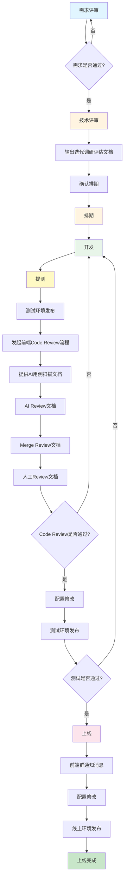

## 流程图

```mermaid
flowchart TD
    A[需求评审] --> B{需求是否通过?}
    B -->|否| A
    B -->|是| C[技术评审]
    
    C --> C1[输出迭代调研评估文档]
    C1 --> C2[确认排期]
    C2 --> D[排期]
    
    D --> E[开发]
    E --> F[提测]
    
    F --> F1[测试环境发布]
    F1 --> F2[发起前端Code Review流程]
    
    F2 --> F2a[提供AI用例扫描文档]
    F2a --> F2b[AI Review文档]
    F2b --> F2c[Merge Review文档]
    F2c --> F2d[人工Review文档]
    
    F2d --> F3{Code Review是否通过?}
    F3 -->|否| E
    F3 -->|是| F4[配置修改]
    F4 --> F5[测试环境发布]
    
    F5 --> G{测试是否通过?}
    G -->|否| E
    G -->|是| H[上线]
    
    H --> H1[前端群通知消息]
    H1 --> H2[配置修改]
    H2 --> H3[线上环境发布]
    H3 --> I[上线完成]
    
    style A fill:#e1f5ff
    style C fill:#fff4e1
    style D fill:#fff4e1
    style E fill:#e8f5e9
    style F fill:#fff9c4
    style H fill:#fce4ec
    style I fill:#c8e6c9
```