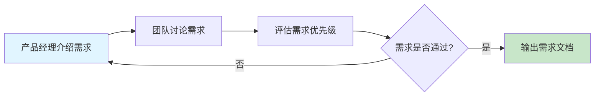
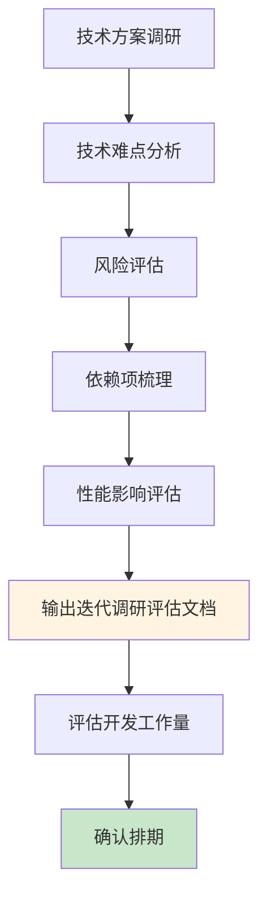
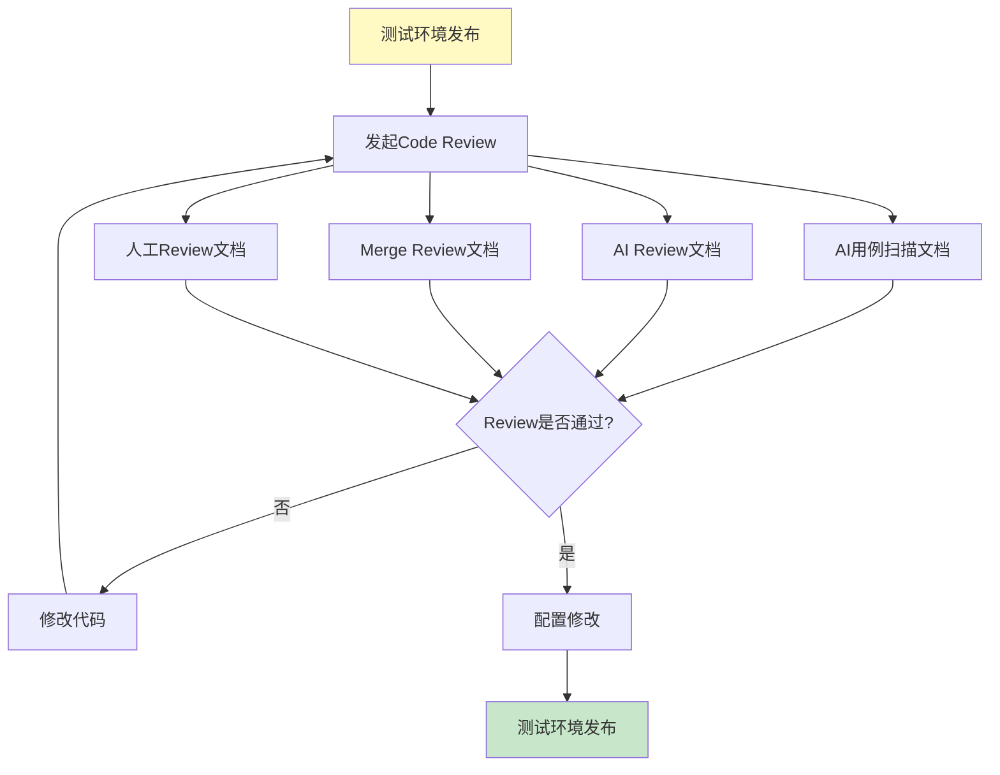
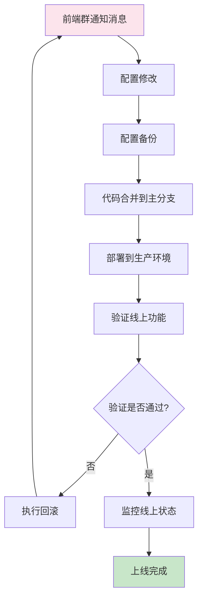
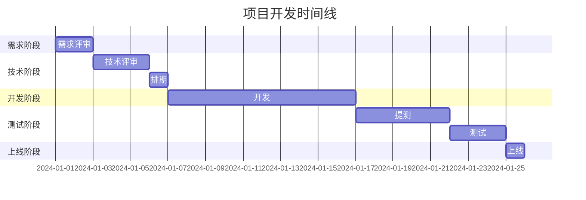
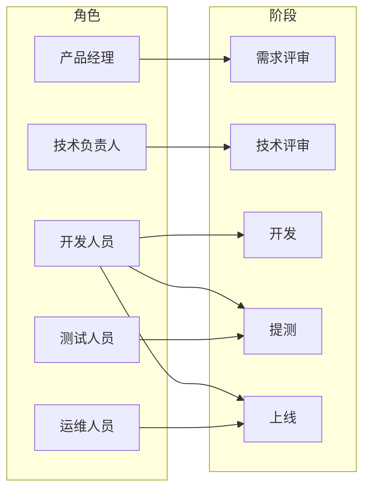
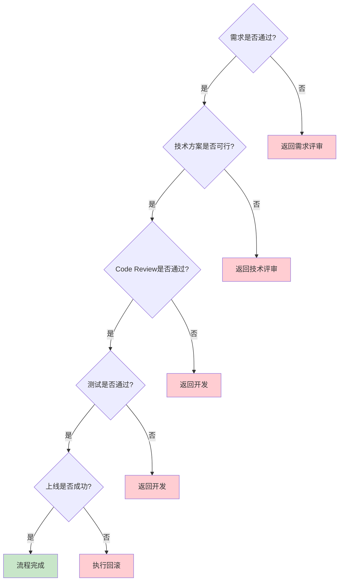

# 项目开发工作流程图

## 完整流程图

```mermaid
flowchart TD
    Start([开始]) --> A[需求评审]
    
    A --> A1{需求是否明确?}
    A1 -->|否| A
    A1 -->|是| A2{需求是否通过?}
    A2 -->|否| A
    A2 -->|是| B[技术评审]
    
    B --> B1[输出迭代调研评估文档]
    B1 --> B2[技术方案评估]
    B2 --> B3[风险评估]
    B3 --> B4[确认排期]
    B4 --> B5{技术评审是否通过?}
    B5 -->|否| B
    B5 -->|是| C[排期]
    
    C --> C1[确定开发时间]
    C1 --> C2[分配开发任务]
    C2 --> C3[确定提测时间]
    C3 --> C4[确定上线时间]
    C4 --> D[开发]
    
    D --> D1[搭建开发环境]
    D1 --> D2[编码实现]
    D2 --> D3[编写单元测试]
    D3 --> D4[代码自测]
    D4 --> D5{开发是否完成?}
    D5 -->|否| D2
    D5 -->|是| E[提测]
    
    E --> E1[测试环境发布]
    E1 --> E2[发起前端Code Review流程]
    
    E2 --> E2a[提供AI用例扫描文档]
    E2a --> E2b[生成AI Review文档]
    E2b --> E2c[生成Merge Review文档]
    E2c --> E2d[生成人工Review文档]
    
    E2d --> E3{Code Review是否通过?}
    E3 -->|否| E4[修改代码]
    E4 --> D2
    E3 -->|是| E5[配置修改]
    E5 --> E6[测试环境发布]
    
    E6 --> F{测试是否通过?}
    F -->|否| E7[修复Bug]
    E7 --> D2
    F -->|是| G[上线]
    
    G --> G1[前端群通知消息]
    G1 --> G2[配置修改]
    G2 --> G3[线上环境发布]
    G3 --> G4{上线是否成功?}
    G4 -->|否| G5[执行回滚]
    G5 --> G
    G4 -->|是| G6[验证线上功能]
    G6 --> End([结束])
    
    style Start fill:#c8e6c9
    style End fill:#c8e6c9
    style A fill:#e1f5ff
    style B fill:#fff4e1
    style C fill:#fff4e1
    style D fill:#e8f5e9
    style E fill:#fff9c4
    style G fill:#fce4ec
```

## 阶段详细流程图

### 1. 需求评审阶段

### 2. 技术评审阶段

### 3. 提测阶段 - Code Review流程

### 4. 上线阶段

## 各阶段时间节点

## 角色职责矩阵

## 关键决策点

---

**说明**：
- 绿色节点：成功/完成状态
- 蓝色节点：需求相关
- 黄色节点：技术/排期相关
- 浅绿色节点：开发相关
- 浅黄色节点：测试相关
- 粉色节点：上线相关
- 红色节点：回退/失败状态

