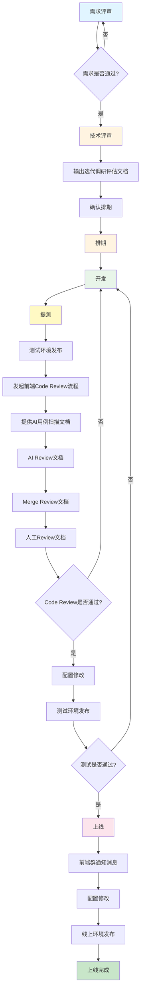

# 项目开发工作流程文档

## 概述

本文档描述了从需求评审到上线的完整开发工作流程，确保项目按照标准化流程推进，提高开发效率和代码质量。

## 工作流程阶段

### 1. 需求评审

**目标**：明确需求内容，确认需求可行性和优先级

**参与人员**：产品经理、项目经理、开发负责人、测试负责人

**主要工作**：
- 产品经理介绍需求背景和目标
- 团队讨论需求细节和边界
- 评估需求优先级和紧急程度
- 确认需求是否进入下一阶段

**输出物**：
- 需求评审会议纪要
- 需求文档（已确认版本）

---

### 2. 技术评审

**目标**：评估技术方案可行性，确定开发排期

**参与人员**：技术负责人、开发人员、架构师（如需要）

**主要工作**：
- **输出迭代调研评估文档**
  - 技术方案调研
  - 技术难点分析
  - 风险评估
  - 依赖项梳理
  - 性能影响评估
- **确认排期**
  - 评估开发工作量
  - 确定开发时间节点
  - 确认资源分配
  - 制定里程碑计划

**输出物**：
- 迭代调研评估文档
- 技术方案文档
- 开发排期计划

---

### 3. 排期

**目标**：正式确定开发计划和时间节点

**参与人员**：项目经理、开发负责人、测试负责人

**主要工作**：
- 确认开发排期时间
- 分配开发任务
- 确定提测时间节点
- 确定上线时间节点
- 同步相关干系人

**输出物**：
- 项目排期表
- 任务分配清单

---

### 4. 开发

**目标**：按照技术方案完成功能开发

**参与人员**：开发人员

**主要工作**：
- 搭建开发环境
- 按照技术方案进行编码
- 编写单元测试
- 代码自测
- 提交代码到开发分支
- 解决开发过程中的技术问题

**输出物**：
- 功能代码
- 单元测试代码
- 开发自测报告

---

### 5. 提测

**目标**：完成代码审查和测试环境发布，准备测试

**参与人员**：开发人员、测试人员、Code Review负责人

**主要工作**：

#### 5.1 测试环境发布
- 部署代码到测试环境
- 验证测试环境可用性

#### 5.2 发起前端Code Review流程

**5.2.1 提供AI用例扫描文档**
- 使用AI工具扫描代码
- 生成用例扫描报告
- 识别潜在问题和风险点

**5.2.2 AI Review文档**
- AI代码审查报告
- 代码质量评分
- 建议改进点

**5.2.3 Merge Review文档**
- 未来云AI代码审查报告
- 冲突检查
- 合并策略确认

**5.2.4 人工Review文档**
- 资深开发人员代码审查
- 代码规范检查
- 业务逻辑审查
- 性能优化建议

#### 5.3 配置修改
- 修改测试环境配置
- 配置项检查

#### 5.4 测试环境发布
- 最终确认测试环境
- 通知测试人员开始测试

**输出物**：
- AI用例扫描文档
- AI Review文档
- Merge Review文档
- 人工Review文档
- 测试环境发布通知
- Code Review通过确认

---

### 6. 上线

**目标**：将功能发布到生产环境

**参与人员**：开发人员、运维人员、测试人员

**主要工作**：

#### 6.1 前端群通知消息
- 在相关前端群组发布上线通知
- 说明上线内容和时间
- 提醒相关人员关注

#### 6.2 配置修改
- 修改生产环境配置
- 配置项检查
- 配置备份

#### 6.3 线上环境发布
- 代码合并到主分支
- 部署到生产环境
- 验证线上功能
- 监控线上状态

**输出物**：
- 上线通知消息
- 上线发布记录
- 上线验证报告

---

## 流程图

## 各阶段检查清单

### 需求评审检查清单
- [ ] 需求文档完整清晰
- [ ] 需求优先级已确认
- [ ] 相关干系人已参与评审
- [ ] 需求评审会议纪要已记录

### 技术评审检查清单
- [ ] 迭代调研评估文档已输出
- [ ] 技术方案已确定
- [ ] 开发排期已确认
- [ ] 风险评估已完成

### 排期检查清单
- [ ] 开发排期时间已确定
- [ ] 任务已分配
- [ ] 提测时间已确定
- [ ] 上线时间已确定

### 开发检查清单
- [ ] 代码已提交
- [ ] 单元测试已编写
- [ ] 开发自测已完成
- [ ] 代码符合规范

### 提测检查清单
- [ ] 测试环境已发布
- [ ] AI用例扫描文档已提供
- [ ] AI Review文档已提供
- [ ] Merge Review文档已提供
- [ ] 人工Review文档已提供
- [ ] Code Review已通过
- [ ] 配置已修改
- [ ] 测试环境已最终发布

### 上线检查清单
- [ ] 前端群通知消息已发送
- [ ] 配置已修改
- [ ] 线上环境已发布
- [ ] 线上功能已验证
- [ ] 监控状态正常

## 注意事项

1. **需求变更**：如需求发生变更，需要重新进行需求评审和技术评审
2. **Code Review**：所有代码必须通过Code Review才能进入测试阶段
3. **测试环境**：确保测试环境配置与生产环境尽可能一致
4. **上线时间**：建议在业务低峰期进行上线操作
5. **回滚方案**：每次上线前必须准备回滚方案
6. **监控告警**：上线后密切关注监控告警信息

## 相关文档

- 需求文档模板
- 技术方案文档模板
- Code Review规范
- 上线操作手册

---

**文档版本**：v1.0  
**最后更新**：2024年  
**维护人员**：开发团队

